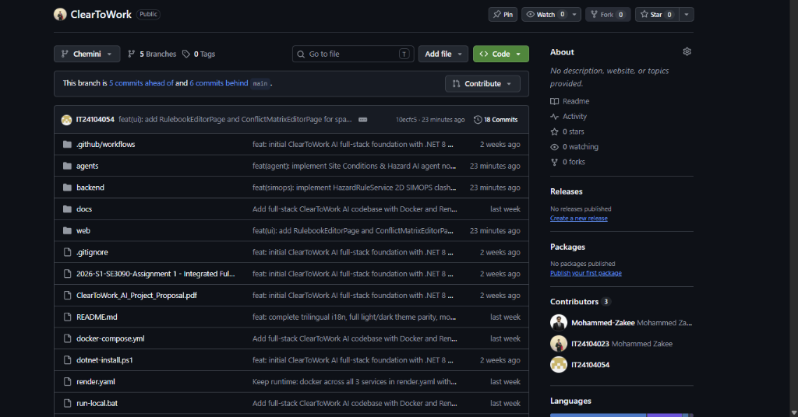
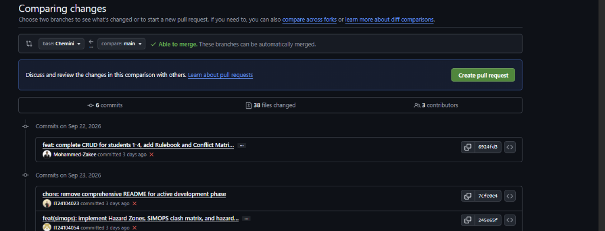
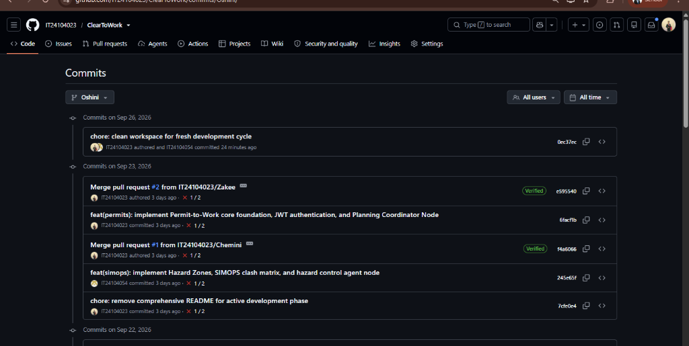
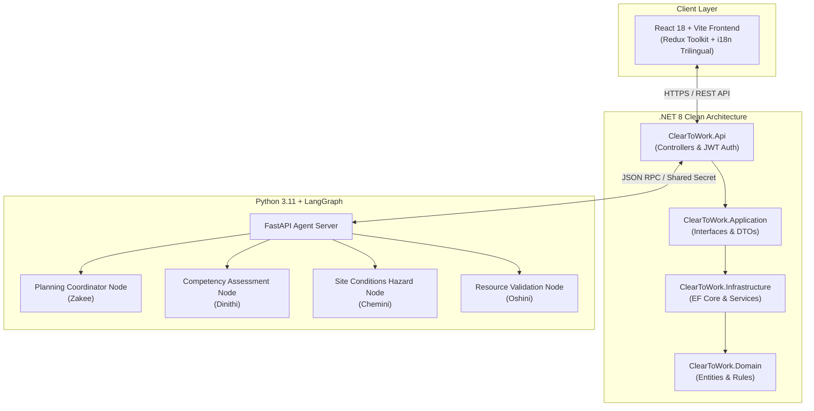

# 🛡️ ClearToWork AI — Intelligent Permit-to-Work (PTW) Safety System

[](https://github.com/IT24104023/ClearToWork/actions)
[](https://dotnet.microsoft.com/)
[](https://react.dev/)
[](https://python.langchain.com/)
[](https://www.docker.com/)
[](https://render.com/)

An enterprise-grade, **AI-orchestrated Permit-to-Work (PTW) safety management system** tailored for high-risk oil & gas offshore/onshore installations. **ClearToWork AI** combines a high-performance **.NET 8 Clean Architecture** backend, a dynamic **React 18 + TypeScript** command center, and a **Python LangGraph multi-agent artificial intelligence network** to automate permit verification, hazard clash detection, workforce qualification checks, and gas detector calibrations.

---

## 🌐 Live Application & API Deployment Links

| Environment / Service | Deployment URL | Description / Documentation |
| :--- | :--- | :--- |
| 🖥️ **Live Web Application** | [https://cleartowork-frontend.onrender.com](https://cleartowork-frontend.onrender.com) | React 18 + Redux Command Center UI |
| ⚡ **REST API (Backend)** | [https://cleartowork-backend.onrender.com/swagger](https://cleartowork-backend.onrender.com/swagger) | ASP.NET Core 8 OpenAPI / Swagger Documentation |
| 🤖 **AI Orchestrator Engine** | [https://cleartowork-agent.onrender.com/docs](https://cleartowork-agent.onrender.com/docs) | Python FastAPI + LangGraph Agent Docs |
| 📦 **GitHub Repository** | [https://github.com/IT24104023/ClearToWork](https://github.com/IT24104023/ClearToWork) | Official Team Codebase |

---

## 👥 SLIIT SE3090 Team Allocation & Contributions

| Student ID | Team Member | Module & Domain Specialty | Core Features Delivered |
| :--- | :--- | :--- | :--- |
| **IT24104023** | **Mohammed Zakee** | **Permits & Planning** | PTW State Machine, JWT Auth, PDF Exporter, Planning Agent Node, Rate Limiting |
| **IT24104198** | **Dinithi** | **Workforce & Competency** | Worker Credential Tracking, Competency Scorer, Fatigue Limits, Competency Agent Node |
| **IT24104054** | **Chemini** | **Hazard Zones & SIMOPS** | Spatial Clash Matrix, GeoJSON Boundary Validator, SIMOPS Agent Node, Evacuation Routes |
| **IT24103874** | **Oshini** | **Equipment & Gas Calibration** | Gas Telemetry Analyzer, LOTO Lock Verification, SCBA Pressure Checker, Validation Agent Node |

---

## 📸 System Screenshots & Command Center Preview

### 1. Unified Safety Dashboard & Live Telemetry


### 2. Multi-Agent AI QChat Command Center


### 3. GitHub Multi-Branch Contribution History


---

## 🏗️ System Architecture & Multi-Agent Workflow



---

## 🚀 Key Functional Modules

### 📋 1. Permits & Planning (Mohammed Zakee — IT24104023)
- **Permit Lifecycle State Machine**: Draft $\rightarrow$ Pending Approval $\rightarrow$ Active $\rightarrow$ Suspended $\rightarrow$ Closed.
- **JWT Authentication & Security**: Sliding-window token refresh middleware, role-based access control (Admin, Issuing Authority, Performing Authority, Safety Officer).
- **PDF Export Engine**: Automated generation of printable PTW certificates with QR verification codes.
- **AI Planning Coordinator Node**: Parses natural language permit requests and suggests required isolation certificates (ICCs).

### 👷 2. Workforce & Competency (Dinithi — IT24104198)
- **Credential Expiry Forecasting**: Automated 30-day warning window for OPITO, BOSIET, CompEx, and Offshore Medical certifications.
- **Competency Matrix Scorer**: Weighted scoring algorithm matching trade roles (e.g. Rig Electrician, Scaffold Inspector) against active qualifications.
- **Fatigue Management**: OSHA/OGUK 12-hour shift limit compliance tracker with mandatory rest recommendations.
- **AI Competency Node**: Validates worker eligibility in real-time prior to permit activation.

### ⚠️ 3. Hazard Zones & SIMOPS (Chemini — IT24104054)
- **SIMOPS Spatial Clash Matrix**: Detects hazardous simultaneous operations (e.g., Hot Work Grinding vs. Diesel Bunkering within 15 meters).
- **GeoJSON Boundary Validator**: Ensures valid polygon coordinates for plant exclusion zones and blast buffers.
- **Wind Vector Safety Engine**: Dynamically calculates spark dispersion boundaries based on live anemometer data.
- **AI Hazard Node**: Scans plant GIS coordinates and flags spatial/temporal conflicts.

### ⛽ 4. Equipment & Gas Calibration (Oshini — IT24103874)
- **Atmospheric Gas Reading Analyzer**: Evaluates multi-gas telemetry ($H_2S$, $LEL$, $CO$, $O_2$) against OSHA 1910.146 thresholds with 4-tier alarm escalation.
- **OSHA 1910.147 LOTO Verification**: Enforces "One Person, One Lock, One Key" rules, detects orphaned locks, and checks zero-energy isolation.
- **SCBA & Equipment Calibration**: Tracks daily bump tests and cylinder pressure threshold checks.
- **AI Resource Validation Node**: Confirms gas detector readiness before approving hot work or confined space entry.

---

## 🛠️ Local Development & Installation Guide

### Prerequisites
- [.NET 8 SDK](https://dotnet.microsoft.com/download/dotnet/8.0)
- [Node.js 18+](https://nodejs.org/)
- [Python 3.11+](https://www.python.org/)
- [Docker Desktop](https://www.docker.com/) (Optional for containerized run)

### Running with Docker Compose (Recommended)
```bash
# Clone repository
git clone https://github.com/IT24104023/ClearToWork.git
cd ClearToWork

# Start full multi-container stack (Backend, Frontend, AI Agents)
docker-compose up --build
```
- **Web App**: `http://localhost:3000`
- **Backend Swagger**: `http://localhost:5000/swagger`
- **Agent Server**: `http://localhost:8000/docs`

---

## 🧪 Testing & Verification

```bash
# Run .NET Backend & Domain Unit Tests
dotnet test backend/ClearToWork.sln

# Run Python Agent Service Tests
cd agents
pytest
```

---

## 📄 License & Academic Attribution
Developed as part of the **SLIIT SE3090 Integrated Full-Stack AI Application** course (2026).  
© 2026 ClearToWork AI Team — All rights reserved.
