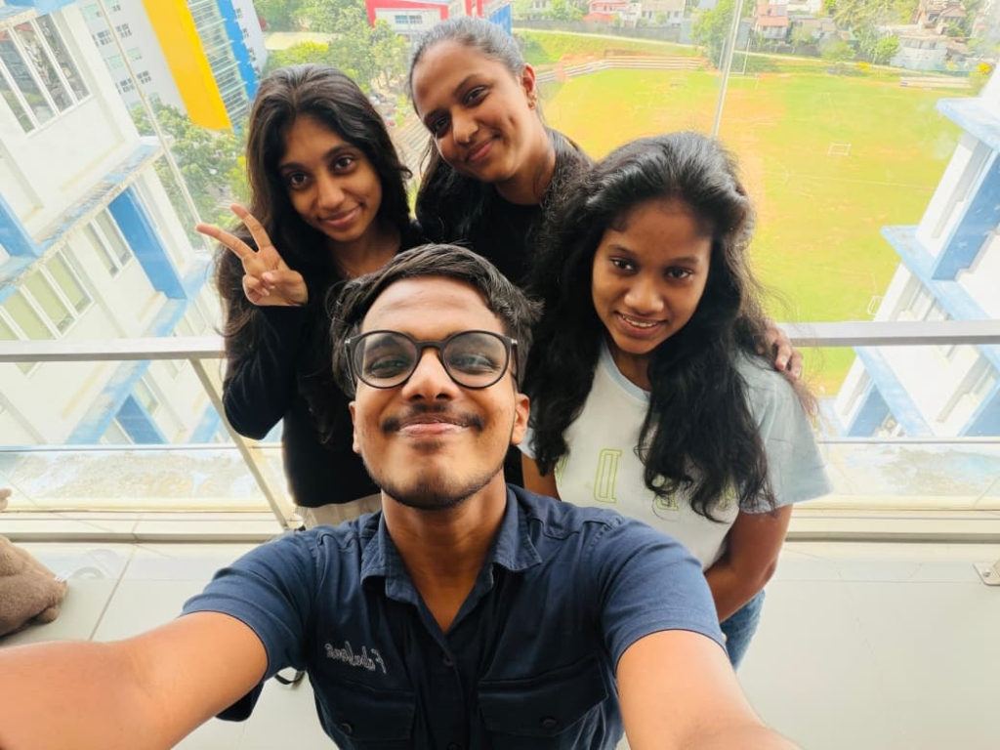
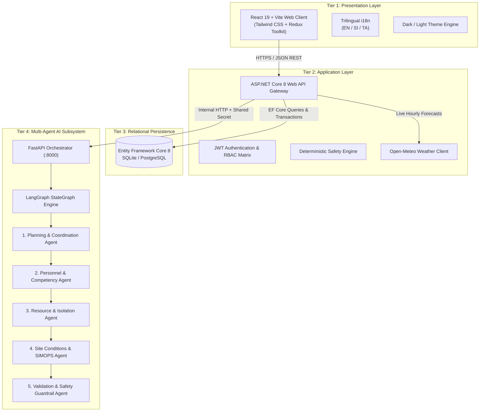
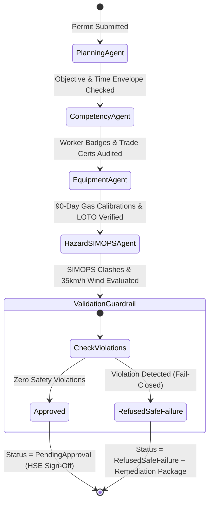

# ClearToWork AI · Industrial Safety Clearance Engine

<div align="center">



**Autonomous 5-Agent Permit-to-Work (PTW) Verification, SIMOPS Spatial Conflict Engine, and Fail-Closed Clearance for High-Hazard Petrochemical Plants.**

[](https://dotnet.microsoft.com/)
[](https://react.dev/)
[](https://langchain-ai.github.io/langgraph/)
[](https://fastapi.tiangolo.com/)
[](https://www.docker.com/)
[](https://render.com/)
[](https://github.com/IT24104023/ClearToWork-Main)
[](LICENSE)

</div>

---

## 🌐 Live Cloud Deployments (Render)

| Service | Environment | Live URL | Description |
| :--- | :--- | :--- | :--- |
| **Frontend Web Portal** | Production | [cleartowork-frontend.onrender.com](https://cleartowork-frontend.onrender.com) | 3D Interactive React 19 Client with Trilingual & Light/Dark Support |
| **Backend REST API** | Production | [cleartowork-backend.onrender.com/swagger](https://cleartowork-backend.onrender.com/swagger) | ASP.NET Core 8 API Gateway with Interactive Swagger OpenAPI |
| **Multi-Agent Engine** | Production | [cleartowork-agent.onrender.com/health](https://cleartowork-agent.onrender.com/health) | Python LangGraph 5-Agent Deterministic Verification Pipeline |

---

## 📖 Executive Summary & Problem Domain

In high-hazard facilities such as oil refineries, petrochemical processing complexes, and offshore fabrication yards, catastrophic incidents (uncontrolled fires, toxic gas leaks, and vapor cloud explosions) routinely occur due to **three primary failure modes in legacy manual/paper Permit-to-Work (PTW) workflows**:

1. **SIMOPS Spatial Clashes**: Simultaneous incompatible activities occurring in adjacent physical plant zones (e.g., hot welding occurring 15m away from volatile solvent tank purging) without mutual cross-referencing on paper permits.
2. **Uncalibrated & Expired Safety Assets**: Expired 90-day multi-gas monitors, uninspected fire extinguishers, or missing physical Lock-Out/Tag-Out (LOTO) isolation points passing physical inspections without automated verification.
3. **Unqualified Crews**: Workers with expired trade certifications (welding, confined space, scaffolding) assigned to high-risk areas due to spreadsheet blindspots.

### The ClearToWork AI Solution
**ClearToWork AI** replaces fragmented paper permits with a **Deterministic, 5-Agent Directed Acyclic Graph (DAG)** built on **LangGraph**. ClearToWork AI enforces a strict **Fail-Closed Safety Policy**: if any safety rule, qualification, calibration tag, or SIMOPS distance envelope is violated, the clearance is immediately marked as `REFUSED_SAFE_FAILURE` with an automated synthesized remediation fix.

---

## ⚡ Key Highlights & Core Capabilities

- **3D Animated Landing Experience**: Built with interactive physics-based particle canvas, specular glare tilt cards, pixel grid swap animations, and floating multi-card navigation headers.
- **Trilingual Localization (i18n)**: Instant switching between **English (EN)**, **Sinhala (සිංහල - SI)**, and **Tamil (தமிழ் - TA)** across all pages, forms, agent telemetry, and technical documents.
- **Dynamic Light & Dark Modes**: Clean, theme-adaptive styling with smooth transitions between industrial dark mode (`#020617` / `#030712`) and high-contrast light mode (`#f8fafc` / `#ffffff`).
- **Real-Time QChat Agent Command Center**: Live interactive simulation terminal where safety officers can execute custom permit scenarios, view step-by-step LangGraph node executions, and inspect fail-safe remediation plans.
- **Meteorological Safeguards**: Direct live integration with the **Open-Meteo API** to enforce strict **35.0 km/h wind gust ceilings** for elevated hot work/cranes and precipitation cutoffs for solvent work.
- **Cryptographic RBAC Matrix**: Multi-role token security (Contractor Supervisor, HSE Safety Officer, Area Supervisor, System Administrator).

---

## 👥 Student Component Ownership & Architectural Division

Aligned with enterprise microservice standards and academic grading specifications:

```
┌──────────────────────────────────────────────────────────────────────────────────┐
│                             ClearToWork AI System                                │
├─────────────────────────┬──────────────────────────┬─────────────────────────────┤
│ Student Component       │ Microservice Domain      │ Agentic AI Contribution     │
├─────────────────────────┼──────────────────────────┼─────────────────────────────┤
│ Student 1 (Member 1)    │ Workforce & Competencies │ Personnel & Competency Node │
│ Student 2 (Member 2)    │ Equipment & LOTO Points  │ Resource & Isolation Node   │
│ Student 3 (Member 3)    │ Permit Drafting & JWT    │ Planning & Coordinator Node │
│ Student 4 (Member 4)    │ SIMOPS Zones & Weather   │ Site & Hazard Control Node  │
│ Shared Engineering      │ DB Admin, QChat & UI     │ Validation & Guardrail Node │
└─────────────────────────┴──────────────────────────┴─────────────────────────────┘
```

### Detailed Student Breakdown

#### 👷 Student 1: Workforce, Competency & Certification Management
- **Domain**: Worker profiles, digital badge scanning, trade qualification tracking (Welder, Confined Space Entry, Rigger, Scaffolder).
- **Core Agent**: **Personnel & Competency Agent** (`agents/nodes/competency_agent.py`).
- **Autonomous Features**: 30-day credential expiry forecasting, trade mismatch detection, and automated synthesis of certified replacement crew members.
- **Key Endpoints**: `GET /api/workforce/workers`, `GET /api/workforce/certificates`, `POST /api/workforce/workers`.

#### 🧯 Student 2: Safety Equipment & LOTO Isolation Management
- **Domain**: Safety asset registry (multi-gas detectors, dry chemical extinguishers, explosion-proof blowers, harnesses), 90-day calibration intervals, Lock-Out / Tag-Out (LOTO) isolation points.
- **Core Agent**: **Resource & Isolation Agent** (`agents/nodes/equipment_agent.py`).
- **Autonomous Features**: Overdue calibration flagging, uncalibrated equipment refusal, isolation point validation.
- **Key Endpoints**: `GET /api/equipment`, `GET /api/equipment/isolations`, `POST /api/equipment/assets`.

#### 📋 Student 3: Permit Lifecycle, Authentication & Digital Sign-Off
- **Domain**: Cryptographic JWT authentication, role claims, permit drafting state machine (Draft → Submitted → AiReview → PendingApproval → Approved / Refused → Active → Closed).
- **Core Agent**: **Planning & Coordination Agent** (`agents/nodes/planning_agent.py`).
- **Autonomous Features**: Objective decomposition, hazard duration envelope clamping, mandatory fire watch assignment.
- **Key Endpoints**: `POST /api/auth/login`, `POST /api/auth/register`, `GET /api/permits`, `POST /api/permits`, `POST /api/permits/{id}/submit-ai`.

#### 🌦️ Student 4: Hazard Zones, Environmental SIMOPS & Meteorology
- **Domain**: Geospatial plant zones (Cracking Unit, Solvent Tank Farm, Flare Header), radius boundaries, spatial-temporal clash matrix, live Open-Meteo meteorological integration.
- **Core Agent**: **Site Conditions & Hazard Control Agent** (`agents/nodes/hazard_agent.py`).
- **Autonomous Features**: Real-time hot work vs. solvent conflict detection within 50m radius, live wind gust checks (≥35 km/h cutoff), and rainfall precipitation warnings.
- **Key Endpoints**: `GET /api/hazard-rules/zones`, `GET /api/hazard-rules/conflicts`, `GET /api/hazard-rules/weather`.

#### 🛡️ Shared Architecture: Validation, Security, Database Admin & QChat
- **Core Agent**: **Validation & Safety Guardrail Agent** (`agents/nodes/validation_agent.py`).
- **Autonomous Features**: Fail-closed final consensus synthesis, multi-agent remediation packages, ADR technical docs, database seeding and schema management.

---

## 🏛️ System Architecture (4-Tier Integrated Pipeline)



---

## 🤖 LangGraph Multi-Agent Workflow



---

## 🔑 Demo Credentials & Role-Based Access Control (RBAC)

The system is pre-seeded with authoritative demo personas for evaluation and live viva demonstration:

| Role | Email Address | Password | Permissions & Operational Scope |
| :--- | :--- | :--- | :--- |
| **HSE Safety Officer** | `safety@cleartowork.com` | `Password123!` | Authoritative clearance sign-off, rulebook modifications, safe failure audits, QChat admin |
| **Contractor Supervisor** | `supervisor@contractor.com` | `Password123!` | Permit drafting, worker assignment, equipment checkout, permit activation |
| **Area Supervisor** | `areasup@cleartowork.com` | `Password123!` | Zone spatial boundaries, SIMOPS conflict monitoring, emergency halts |
| **System Administrator** | `admin@cleartowork.com` | `Password123!` | Full RBAC management, database schema recreation, benchmark seeding |

---

## 🚀 Quick Start Guide (Local Setup)

### Prerequisites
- [.NET 8.0 SDK](https://dotnet.microsoft.com/download/dotnet/8.0)
- [Node.js 18+](https://nodejs.org/) & `npm`
- [Python 3.10+](https://www.python.org/)
- [Docker Desktop](https://www.docker.com/) *(optional for containerized setup)*

---

### Option A: One-Click Startup (Recommended for Windows)

Run the included PowerShell launch script from the project root:

```powershell
.\run-local.ps1
```

Or execute the batch file:
```cmd
run-local.bat
```

*This automatically launches the Python Multi-Agent Service (`:8000`), the ASP.NET Core Backend (`:5000`), and the React Frontend (`:5173`) in independent processes.*

---

### Option B: Manual Step-by-Step Launch

#### 1. Python Multi-Agent Engine
```bash
# From project root:
cd agents
python -m venv venv
# Windows:
.\venv\Scripts\activate
# Linux/macOS:
source venv/bin/activate

pip install -r requirements.txt
python -m uvicorn server:app --host 127.0.0.1 --port 8000 --reload
```

#### 2. ASP.NET Core Backend API
```bash
# In a new terminal from project root:
cd backend/src/ClearToWork.Api
dotnet restore
dotnet run --launch-profile http
```
*Swagger UI will be accessible at: `http://localhost:5000/swagger`*

#### 3. React Frontend Client
```bash
# In a new terminal from project root:
cd web
npm install
npm run dev -- --host 127.0.0.1 --port 5173
```
*Web App will be accessible at: `http://localhost:5173`*

---

### Option C: Containerized Deployment (Docker Compose)

```bash
docker compose up --build
```

---

## 📦 Project Repository Structure

```
ClearToWork AI/
├── agents/                           # Python LangGraph Multi-Agent Engine
│   ├── graph.py                      # StateGraph definition & edge conditions
│   ├── models.py                     # Strongly-typed AgentWorkflowState models
│   ├── server.py                     # FastAPI REST API & webhook listener
│   ├── Dockerfile                    # Container definition for Python agents
│   ├── requirements.txt              # LangGraph, FastAPI, Pydantic, Uvicorn
│   ├── nodes/                        # 5 Specialized Agent Nodes
│   │   ├── planning_agent.py         # Node 1: Objective & Duration Envelope
│   │   ├── competency_agent.py       # Node 2: Badges & Trade Certificates
│   │   ├── equipment_agent.py        # Node 3: Gas Calibration & LOTO
│   │   ├── hazard_agent.py           # Node 4: SIMOPS & Open-Meteo Weather
│   │   └── validation_agent.py       # Node 5: Fail-Closed Guardrail & Fixes
│   └── tools/                        # Deterministic agent execution tools
│       ├── permit_tools.py
│       ├── workforce_tools.py
│       ├── equipment_tools.py
│       └── hazard_tools.py
│
├── backend/                          # ASP.NET Core 8 Web API Gateway
│   ├── Dockerfile                    # Multi-stage .NET 8 build container
│   └── src/
│       ├── ClearToWork.Api/          # Controllers, JWT Middleware & Program.cs
│       ├── ClearToWork.Core/         # Domain Entities, Enums & Interfaces
│       └── ClearToWork.Infrastructure/# EF Core DbContext, Migrations & Weather Client
│
├── web/                              # React 19 + Vite Frontend Application
│   ├── Dockerfile                    # Node.js + Nginx production container
│   ├── public/                       # Static media (team-photo.jpg, favicon)
│   ├── src/
│   │   ├── components/               # Navbar, Sidebar, ProtectedRoute, StatusBadge
│   │   │   └── animations/           # CardNav, PixelSwap, Hero3DCanvas, TiltCard
│   │   ├── context/                  # ThemeContext (Dark/Light) & I18nContext
│   │   ├── i18n/                     # Trilingual translations (EN, SI, TA)
│   │   ├── pages/                    # Landing, About, Contact, Register, Login, etc.
│   │   ├── store/                    # Redux Toolkit & RTK Query API slice
│   │   └── types/                    # TypeScript interfaces & enums
│   └── package.json
│
├── docs/                             # Technical Architecture Documentation
│   ├── adrs/                         # Architecture Decision Records (ADR-001 - 004)
│   └── architecture/                 # System Architecture, DB Schema, Multi-Agent Specs
│
├── render.yaml                       # Cloud Blueprint for Automated Render Hosting
├── docker-compose.yml                # Multi-service local container orchestrator
├── run-local.ps1                     # PowerShell one-click startup automation
└── README.md                         # Project Master Documentation
```

---

## 🧪 Verification & Automated Testing

### Frontend Build & Typecheck
```bash
cd web
npm run build
```
*Outputs production bundle with **0 TypeScript errors** in `web/dist`.*

### Backend Unit & Integration Tests
```bash
cd backend
dotnet test
```

### Python Agent Unit Tests
```bash
cd agents
pytest tests/ -v
```

---

## 📄 License & Intellectual Property

This project is developed for the **SE3090 — Integrated Full-Stack and Agentic AI Application Development** course (Year 3 Semester 1, 2026). All rights reserved.

<div align="center">
  <sub>Engineered with ❤️ by the ClearToWork AI Engineering Team · 2026</sub>
</div>
